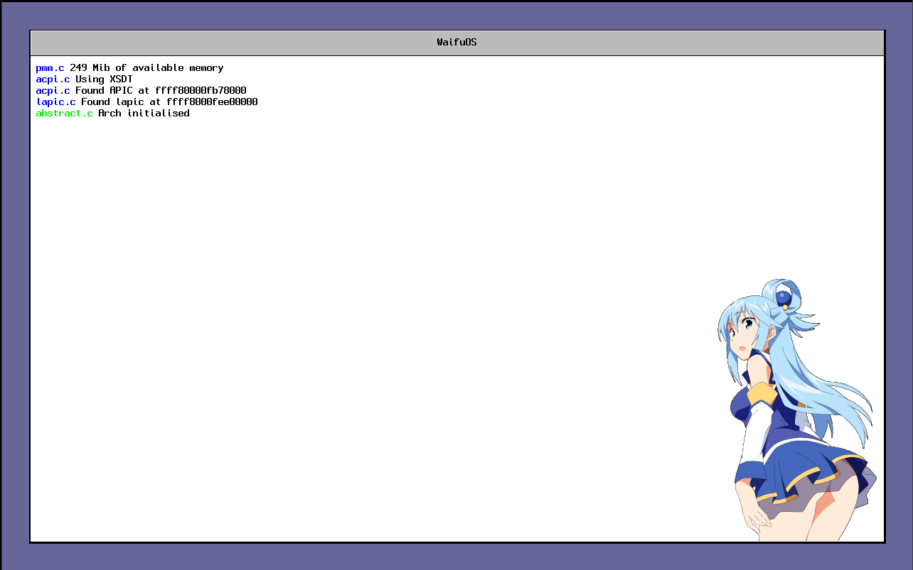

  <h1>WaifuOS</h1>
   
  
  
  
    
  WaifuOS is a <strong>waifu</strong> enhanced <strong>Operating System</strong>
    
  Working with computers all day can be dull and depressing. 
  Enjoy the cuteness of anime women directly on a kernel level !  

# Screenshot

 
WaifuOS running in QEMU

# Supported architecture
- [x] X86_64
- [ ] i386
- [ ] Mips
- [ ] [Athena](https://github.com/AthenaCPU/athena-isa)

# Credits
This project takes inspirations and/or reuse code from the following projects.
See [credits.md](meta/credits.md)

## License

WaifuOS is licensed under the <strong>GPLv3</strong> License.
The full text of the license can be accessed via this link and is also included in the license file of this software package.

